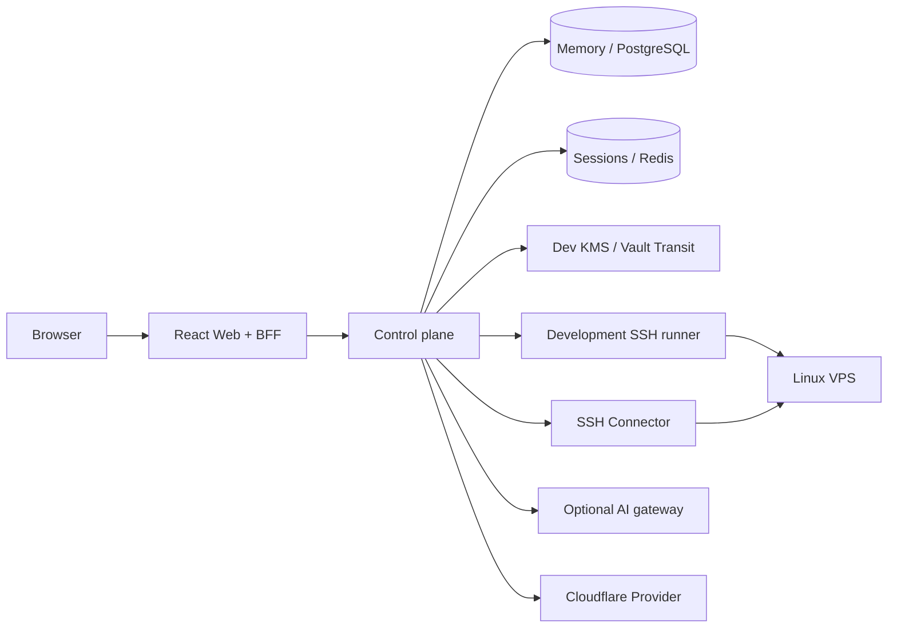

**English** | [简体中文](README.zh-CN.md)

<div align="center">

# VPS Manager

**A self-hosted Linux VPS operations panel for individuals and small teams.**

Manage hosts, SSH access, runtime snapshots, predefined operations, anomalous processes, and Cloudflare Workers from your browser.

[](LICENSE)


</div>

<p align="center">
  
</p>

> [!NOTE]
> The current version targets local development and isolated environments. Production credential handoff and recovery workflows are not yet implemented end-to-end.

## What you can do

| Host management | Routine operations | Analysis and deployment |
|---|---|---|
| Maintain a VPS inventory with tags | View CPU, memory, disk, ports, and services | Scan for anomalous processes using rules |
| Probe and verify SSH host keys | Run predefined commands and parameterized runbooks | Get optional AI explanations and troubleshooting suggestions |
| Store SSH private keys in encrypted form | Open WebSSH sessions in the browser | Manage Workers, versions, deployments, and rollbacks |
| Review jobs and audit records | Cancel jobs and inspect structured results | Store Cloudflare token metadata |

Use predefined commands or parameterized runbooks for routine work, and WebSSH for interactive operations.

## Quick start

Docker Desktop or Docker Engine with Compose is required.

```powershell
$env:VPSMGR_DEV_BOOTSTRAP_TOKEN = [Convert]::ToHexString(
  [Security.Cryptography.RandomNumberGenerator]::GetBytes(32)
).ToLowerInvariant()

$env:VPSMGR_CONNECTOR_HMAC_KEY = [Convert]::ToBase64String(
  [Security.Cryptography.RandomNumberGenerator]::GetBytes(32)
)

docker compose up -d
docker compose ps
```

Open:

- Web: <http://127.0.0.1:3000/login>
- Control plane: <http://127.0.0.1:8080/healthz>

Local development mode provides mock authentication. After entering the workspace, onboard your first host in this order:

```text
Add VPS
  → Probe SSH host key
  → Review and confirm the fingerprint
  → Save SSH credentials
  → Fetch a runtime snapshot
```

Stop the services:

```powershell
docker compose down
```

The Compose setup uses in-memory data and temporary development keys. Restarting the control plane clears hosts, credentials, sessions, jobs, and audit events.

## Workspace

### Hosts

Add an address, port, system user, and tags. Host key probing reads only the SSH server identity. Once the fingerprint is confirmed, subsequent connections use the saved full public key.

### Operations

Runtime snapshots report CPU, memory, load, disk usage, and field-level errors. Predefined commands cover disk usage, listening ports, and common service states. Anomaly scans collect only the PID, parent PID, user, CPU usage, elapsed time, and process name; they do not read full command lines or environment variables.

### WebSSH and runbooks

WebSSH uses single-use terminal tickets. Runbooks generate a preview before execution, and mutating steps are disabled by default. If the terminal disconnects or the page changes, the frontend cancels any ticket request still waiting to be claimed.

### Cloudflare Workers

The workspace supports Worker metadata, encrypted tokens, prebuilt JavaScript modules, deployment plans, and rollback plans. Provider calls are disabled by default; plans are sent to the Cloudflare API only after execution is enabled.

## Architecture



- `web/` provides the user interface, identity bridge, and browser-facing API proxy.
- `services/control-plane/` handles permissions, hosts, jobs, auditing, and operation orchestration.
- `services/connector/` handles SSH, PTY, WebSSH, and runbook execution.
- `services/persistence/` and `services/keymanager/` provide PostgreSQL, Redis, and Vault adapters.

In development mode, runtime snapshots, predefined commands, anomaly scans, and host key probing use the SSH runner built into the control plane. WebSSH and runbooks use the standalone Connector. In production mode, host key probing uses the Connector; the remaining SSH operations are waiting for the credential handoff protocol.

## Default switches

| Capability | Default | Enable with |
|---|---:|---|
| Connect to private-network test VPS instances | Off | `VPSMGR_ALLOW_PRIVATE_TARGETS=true` |
| Run mutating runbooks | Off | `VPSMGR_ENABLE_MUTATIONS=true` |
| Execute Cloudflare deployments and rollbacks | Off | `VPSMGR_ENABLE_CLOUDFLARE_EXECUTION=true` |
| Use a remote AI gateway | Off | Configure all required `VPSMGR_AI_GATEWAY_*` variables when running natively |

The private-network and mutating-runbook switches are passed to both the control plane and the Connector. By default, Compose uses local anomaly-analysis results and does not mount an AI token file.

## Runtime profiles

| Component | Compose | Production configuration |
|---|---|---|
| Data | In-memory repository | PostgreSQL |
| Coordination | In-process job state | Redis readiness check |
| Keys | Temporary Dev KMS with in-process decryption | Vault Transit `wrap-only` |
| Identity | Mock local identity and development sessions | Ed25519-signed identity bridge |
| SSH | Development runner + standalone Connector | Connector integrated; credential handoff not connected |
| Cloudflare | Control plane calls the Provider when configured | Provider integrated; credential handoff not connected |

The production configuration currently supports writing metadata and ciphertext only. WebSSH, runbooks, SSH jobs, and Cloudflare operations that require credential decryption are not yet available.

## Native development

Go services:

```powershell
go build ./services/...
```

Web:

```powershell
cd web
npm ci
npm run build
```

For standalone Connector and control-plane startup options, see:

- [SSH Connector](services/connector/README.md)
- [Control plane API](services/control-plane/README.md)

## Repository layout

```text
web/                         Web UI and BFF
services/control-plane/      API, permissions, jobs, and auditing
services/connector/          SSH, WebSSH, and runbooks
services/ai/                 AI adapter for anomaly results
services/cloudflareprovider/ Cloudflare Workers Provider
services/persistence/        PostgreSQL / Redis
services/keymanager/         Vault Transit
migrations/                  PostgreSQL migrations and permission examples
docs/                        Architecture and operation guides
```

## Documentation

| Document | Contents |
|---|---|
| [Architecture](docs/architecture.md) | Components, data, and execution flows |
| [WebSSH gateway](docs/webssh-gateway.md) | Tickets, WebSocket, and Connector protocol |
| [Runbooks](docs/runbooks.md) | Fixed catalog, previews, and execution flow |
| [Runtime permissions](docs/permission-matrix.md) | Current roles and API permissions |
| [AI analysis](docs/ai-analysis.md) | Inputs, outputs, fallback behavior, and data scope |
| [Cloudflare Provider](docs/cloudflare-provider.md) | Worker version and deployment interfaces |
| [Production adapters](docs/production-adapters.md) | PostgreSQL, Redis, and Vault configuration |

## License

MIT © 2026 [0xmania](https://github.com/0xmania)
