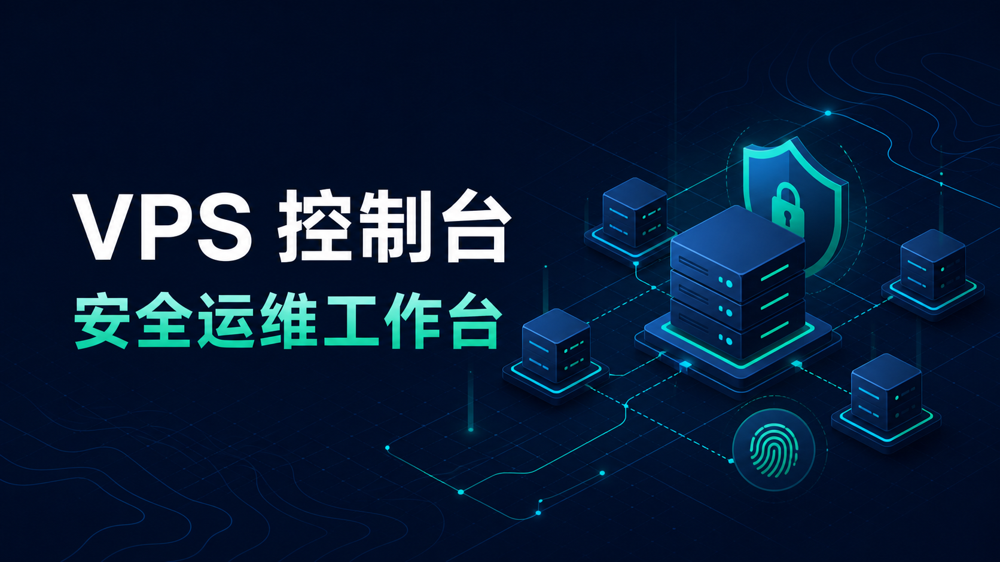
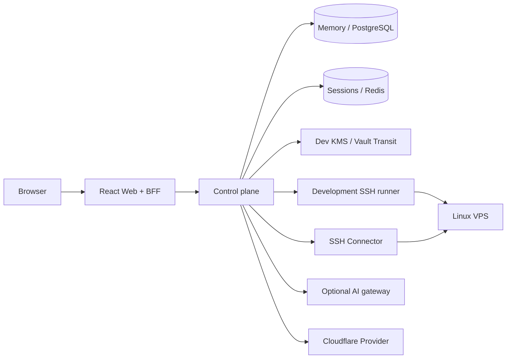

[English](README.md) | **简体中文**

<div align="center">

# VPS Manager

**面向个人和小团队的自托管 Linux VPS 运维面板。**

在浏览器里管理主机、SSH、运行快照、固定运维动作、异常进程和 Cloudflare Workers。

[](LICENSE)


</div>

<p align="center">
  
</p>

> [!NOTE]
> 当前版本面向本地开发和隔离环境，生产凭据交接和恢复流程尚未接通。

## 你可以用它做什么

| 主机管理 | 日常运维 | 分析与发布 |
|---|---|---|
| 维护 VPS 台账和标签 | 查看 CPU、内存、磁盘、端口与服务 | 用规则扫描异常进程 |
| 探测并确认 SSH host key | 执行固定命令和参数化 Runbook | 可选 AI 解读与排查建议 |
| 加密保存 SSH 私钥 | 在浏览器中打开 WebSSH | 管理 Worker、版本、deploy 与 rollback |
| 查看 Job 和审计记录 | 取消任务并查看结构化结果 | 保存 Cloudflare Token 元数据 |

日常操作使用固定命令或参数化 Runbook，交互操作使用 WebSSH。

## 快速启动

需要 Docker Desktop 或 Docker Engine + Compose。

```powershell
$env:VPSMGR_DEV_BOOTSTRAP_TOKEN = [Convert]::ToHexString(
  [Security.Cryptography.RandomNumberGenerator]::GetBytes(32)
).ToLowerInvariant()

$env:VPSMGR_CONNECTOR_HMAC_KEY = [Convert]::ToBase64String(
  [Security.Cryptography.RandomNumberGenerator]::GetBytes(32)
)

docker compose up -d
docker compose ps
```

打开：

- Web：<http://127.0.0.1:3000/login>
- Control plane：<http://127.0.0.1:8080/healthz>

本地开发模式会提供模拟登录。进入工作台后，按下面的顺序完成第一台主机接入：

```text
添加 VPS
  → 探测 SSH host key
  → 核对并确认指纹
  → 保存 SSH 凭据
  → 获取运行快照
```

停止服务：

```powershell
docker compose down
```

Compose 使用内存数据和临时开发密钥，重启控制面会清空主机、凭据、会话、Job 与审计事件。

## 工作区

### Hosts

录入地址、端口、系统用户和标签。host key 探测只读取 SSH 服务端身份；确认后，后续连接都会使用保存的完整公钥。

### Operations

运行快照返回 CPU、内存、负载、磁盘和字段级错误。固定命令支持磁盘、监听端口和常见服务状态。异常扫描只采集 PID、父 PID、用户、CPU、运行时间和进程名，不读取完整命令行或环境变量。

### WebSSH 与 Runbooks

WebSSH 使用一次性终端票据。Runbook 在执行前先生成预览，变更类步骤默认关闭。终端断开或页面切换时，前端会取消仍在等待的票据请求。

### Cloudflare Workers

工作区支持 Worker 元数据、加密 Token、预构建 JavaScript 模块、部署计划和回滚计划。Provider 调用默认关闭，开启后才会把计划发送到 Cloudflare API。

## 架构



- `web/` 负责页面、身份桥和浏览器侧 API 代理。
- `services/control-plane/` 负责权限、主机、任务、审计与操作编排。
- `services/connector/` 负责 SSH、PTY、WebSSH 和 Runbook 执行。
- `services/persistence/` 与 `services/keymanager/` 提供 PostgreSQL、Redis 和 Vault 适配器。

开发模式下，快照、固定命令、异常扫描和 host key 探测走控制面内的 SSH runner，WebSSH 与 Runbook 走独立 Connector。生产模式的 host key 探测走 Connector；其余 SSH 操作还在等待凭据交接协议。

## 默认开关

| 能力 | 默认值 | 开启方式 |
|---|---:|---|
| 连接私网测试 VPS | 关闭 | `VPSMGR_ALLOW_PRIVATE_TARGETS=true` |
| 执行变更 Runbook | 关闭 | `VPSMGR_ENABLE_MUTATIONS=true` |
| 执行 Cloudflare deploy/rollback | 关闭 | `VPSMGR_ENABLE_CLOUDFLARE_EXECUTION=true` |
| 远端 AI 网关 | 关闭 | 原生启动时配置完整 `VPSMGR_AI_GATEWAY_*` 参数 |

私网和变更 Runbook 的开关会同时传给控制面与 Connector。Compose 默认使用本地异常分析结果，不挂载 AI Token 文件。

## 运行模式

| 项目 | Compose | 生产配置 |
|---|---|---|
| 数据 | 内存 Repository | PostgreSQL |
| 协调 | 进程内任务状态 | Redis 就绪检查 |
| 密钥 | 临时 Dev KMS，可在进程内解密 | Vault Transit `wrap-only` |
| 身份 | 本地模拟身份与开发会话 | Ed25519 签名 identity bridge |
| SSH | 开发执行器 + 独立 Connector | Connector 已接入，凭据交接未接通 |
| Cloudflare | 控制面按配置调用 Provider | Provider 已接入，凭据交接未接通 |

生产配置目前只支持元数据和密文写入；需要解密凭据的 WebSSH、Runbook、SSH Job 和 Cloudflare 操作尚不可用。

## 原生开发

Go 服务：

```powershell
go build ./services/...
```

Web：

```powershell
cd web
npm ci
npm run build
```

Connector 和控制面的单独启动参数分别见：

- [SSH Connector](services/connector/README.md)
- [Control plane API](services/control-plane/README.md)

## 目录

```text
web/                         Web UI 与 BFF
services/control-plane/      API、权限、任务和审计
services/connector/          SSH、WebSSH 和 Runbook
services/ai/                 异常结果 AI 适配器
services/cloudflareprovider/ Cloudflare Workers Provider
services/persistence/        PostgreSQL / Redis
services/keymanager/         Vault Transit
migrations/                  PostgreSQL 迁移与权限示例
docs/                        架构与运行说明
```

## 文档

| 文档 | 内容 |
|---|---|
| [Architecture](docs/architecture.md) | 组件、数据与执行流程 |
| [WebSSH gateway](docs/webssh-gateway.md) | 票据、WebSocket 与 Connector 协议 |
| [Runbooks](docs/runbooks.md) | 固定目录、预览与执行流程 |
| [Runtime permissions](docs/permission-matrix.md) | 当前角色与 API 权限 |
| [AI analysis](docs/ai-analysis.md) | 输入输出、降级和数据范围 |
| [Cloudflare Provider](docs/cloudflare-provider.md) | Worker 版本与部署接口 |
| [Production adapters](docs/production-adapters.md) | PostgreSQL、Redis 与 Vault 配置 |

## License

MIT © 2026 [0xmania](https://github.com/0xmania)
