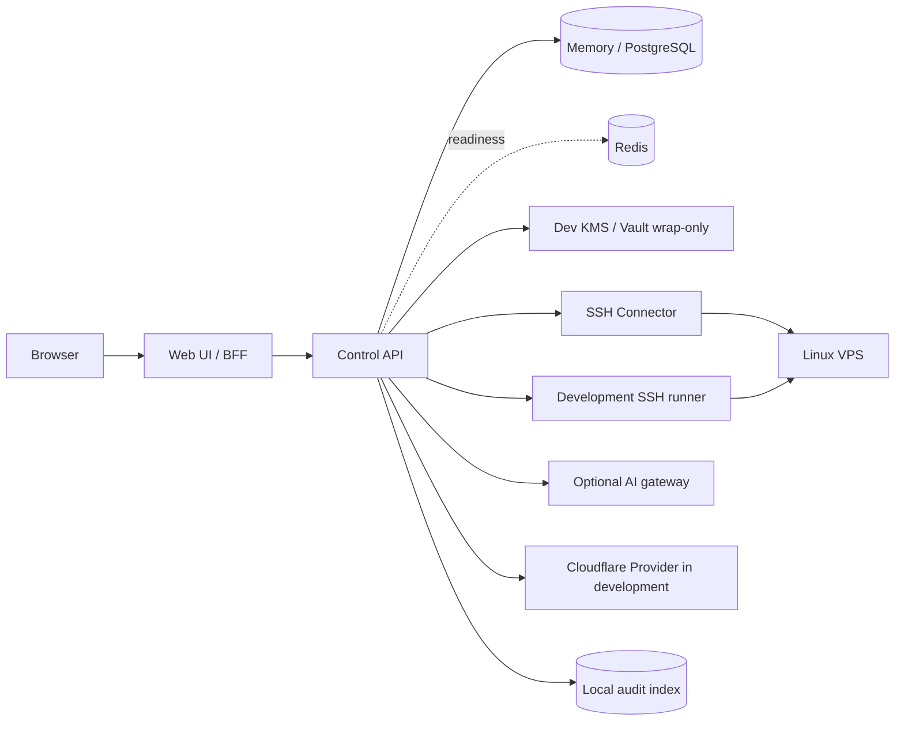

# Web VPS 管理平台架构说明

## 1. 目的与边界

本文把当前代码和已接通能力落实为组件职责和接口边界。系统采用“自托管、单租户、Linux 优先、SSH 无代理接入”的形态；本文中的单租户仍保留 `installation_id` 作为加密和审计上下文，避免对象间密文被替换。

当前已实现：

- 开发会话、Ed25519 identity bridge、服务端授权校验。
- VPS 资产、SSH 连接测试、主机指纹固定和能力探测。
- SSH 私钥加密保存和开发配置下的受控使用。
- 运行快照、基础 Web SSH、Runbook、SSH Job、Cloudflare 相关执行边界的开发态实现。
- 统一任务状态、统一审计响应和秘密脱敏约束。

当前不是 OIDC 生产控制面，也没有 fresh MFA、公共注册、多租户、端口转发、Agent 转发、文件传输、无限制批量 root、AI 自动执行、VPS 自动购买和高可用。生产控制面仍以 wrap-only 为边界；secret handoff 未接通，WebSSH、Runbook、SSH Job、Cloudflare 解密执行仅开发配置可用。支持的 Linux 版本、主机规模和并发上限由具体部署配置决定。

## 2. 架构不变量

以下条件是实现约束，不得只依赖界面提示：

1. 浏览器和 Web 服务不持有可直接使用的 SSH 私钥或 Cloudflare Token；生产控制面使用 wrap-only 身份，开发控制面只在单次操作中打开凭据。
2. 数据库、Redis、任务参数、审计正文、错误响应和遥测不保存秘密明文。
3. 只有开发配置下的执行路径才能按凭据 ID 和版本即时解密对应秘密；生产控制面未接通 secret handoff。
4. 首次 SSH 连接必须经过主机指纹确认；指纹未确认或变化时，命令、快照和终端全部阻断。
5. 普通命令来自服务端固定目录；参数先映射到固定字面量，不接受用户提供的 Shell 文本。
6. HTTP 请求、WebSocket 建连和后台任务真正执行前分别做服务端授权。
7. Web SSH 使用短时、单次、用户—主机—会话—最终参数绑定的票据，并默认禁用各类转发和文件传输。
8. 高风险动作的授权与审批由服务端显式绑定动作、目标和参数摘要。
9. AI 只接触脱敏后的结构化证据，没有 SSH、Vault、进程处置、配置或部署工具权。
10. 当前审计以本地结构化记录和响应约束为主；不存在已接通的远端审计发送链路。

## 3. 逻辑视图

Web UI 与 Control API 可以部署为同一工程或进程边界，但逻辑职责仍需分层。Connector 必须是独立进程和独立运行身份。当前没有已接通的独立 Worker deployer、isolated builder 或远端审计发送器。

## 4. 组件职责与禁止依赖

| 组件 | 主要职责 | 可以访问 | 明确禁止 |
|---|---|---|---|
| Web UI | 页面渲染、用户交互、终端展示 | Control API、会话 Cookie | 访问 Vault/KMS、连接 VPS、接收秘密回显 |
| Control API | 开发会话、identity bridge、授权、资产、策略、任务编排、审计索引 | PostgreSQL、Redis、本地会话与身份桥接 | 直接创建 SSH Shell、长期持有解密后的秘密 |
| SSH Connector | host key 校验、SSH/PTY、采集、命令、Recipe 执行 | 经 HMAC 认证的本机请求、获准 VPS | 通用后台管理 API、用户/角色管理、任意管理网访问 |
| PostgreSQL | 业务元数据、密文、快照、发现项、部署和审计索引 | 仅专用服务身份 | 保存可用秘密明文 |
| Redis | 就绪检查，以及已实现的租约、幂等和取消适配器 | Control API 专用身份 | 保存私钥、Token、完整终端录制、长期事实数据 |
| Vault/KMS | 生产配置下的信封加密 | Control API 的 wrap-only 身份 | 根据用户输入直接选择任意解密上下文 |

## 5. 部署与信任边界

### 5.1 网络区域

| 区域 | 成员 | 入站 | 出站 |
|---|---|---|---|
| Edge | 反向代理 | 仅 `443/tcp` | Web/API |
| Control | Web/API、后台编排器 | 仅 Edge/内部健康检查 | PostgreSQL、Redis、identity bridge、审计索引 |
| Execution | SSH Connector、开发态执行路径 | 仅内部控制 | 获准 VPS、Cloudflare API |
| Data | PostgreSQL、Redis、Vault/KMS | 仅专用服务身份 | 备份目标 |

Connector 的目标地址策略必须在 DNS 解析前后校验：拒绝 loopback、link-local、云元数据地址、控制面/数据面网段和未授权私网；连接前再次校验解析结果，避免 DNS rebinding。允许管理私网 VPS 的场景需要显式 CIDR allowlist，并记录例外原因。

### 5.2 运行身份

Web/API、Connector、数据库、Redis 和密钥客户端使用不同服务账号。任何容器不得挂载宿主 Docker Socket；生产容器尽量采用只读根文件系统、非 root 用户、删除不需要的 Linux capabilities。具体 UID/GID 与密钥服务认证方式由部署实现确定。

## 6. 核心流程

### 6.1 登录与会话

1. API 通过开发会话和 Ed25519 identity bridge 识别调用者，并建立服务端会话。
2. Web 层保留登录状态，并在服务端换取控制面会话。
3. 权限来自服务端本地角色映射和资源级授权。
4. 注销会撤销当前会话；角色或主机范围变化后应撤销受影响的已有会话。

当前没有已接通的 fresh MFA 或生产 OIDC 回调链路。

### 6.2 主机接入与身份固定

1. 用户提交规范化后的主机名/IP、端口和连接配置引用。
2. API 先做地址策略检查；Connector 在解析后重复检查。
3. Connector 只获取 host key，返回算法、SHA-256 指纹和已解析地址，不执行命令。
4. 管理员或获授权运维员通过独立渠道核对后确认指纹。
5. 后续每次 SSH 在认证前比对固定值。变化后主机进入 `host_key_mismatch`，所有执行被拒绝，直至完成受审计的更换流程。

### 6.3 凭据登记与使用

1. 秘密通过专用请求上传，大小和格式先在内存中校验。
2. API 生成凭据 ID 和版本，以 `installation_id + credential_id + version + type` 作为加密上下文调用 Vault/KMS。
3. 只保存密文、引用、类型、指纹/Token 权限摘要和生命周期元数据；响应永不返回秘密。
4. 任务记录仅携带不可变的 `credential_id`、`credential_version` 和已授权目标。
5. 当前生产控制面不向执行侧完成 secret handoff；开发配置下的执行路径会在真正执行前重验任务授权和 host key，再即时解密并尽快释放内存，不落盘。

完整约束见 `credential-lifecycle.md`。

### 6.4 参数化任务、Runbook 与快照

1. API 校验会话、角色、资源范围、目标状态和请求结构。
2. 将模板 ID、模板版本、强类型参数和最终参数摘要固化到任务记录。
3. API 协调任务入队、审批和执行；Connector 不直接消费 Redis 任务队列。
4. 模板生成服务端固定的远端命令字符串；枚举参数先映射为固定字面量，并配置超时、输出上限和取消信号。
5. 输出逐块脱敏后发送，原始秘密不得进入事件流；结束后记录退出码、字段级采集错误和审计事件。

字段未知或采集失败时返回显式错误，不填充猜测值。

### 6.5 Web SSH

1. 用户对确定的主机请求终端票据，需具备 `terminal.open` 权限。
2. API 生成随机、短时、单次票据，服务端保存其哈希并绑定用户、会话、主机、系统用户、权限版本和 host key 版本。
3. WebSocket Upgrade 时校验 Origin、会话、票据、目标和速率；成功后原子消费票据。
4. Connector 在 SSH 握手时再次校验 host key，只建立 PTY shell，禁用 Agent、TCP、X11 转发和文件传输。
5. 生产控制面默认不开放 Web SSH 解密执行；开发配置下由 API 和 Connector 协调关闭现有终端。

终端录制范围和保留期限由审计策略定义。默认只记录会话元数据，不记录可能含秘密的完整输入输出。

### 6.6 Cloudflare Workers 相关执行

1. 用户登记 API Token，平台加密保存；开发 Provider 执行时验证 Token 状态和账户范围，写权限由 Cloudflare API 响应确认。
2. 当前没有已接通的独立 deployer 或 isolated builder。
3. Cloudflare 相关解密执行仅开发配置可用。
4. 平台保存 Cloudflare 返回的版本/部署 ID、状态、操作者和错误分类；代码回滚不宣称回滚 KV、D1、R2 或 Durable Objects 数据。

## 7. 最小数据模型

| 聚合 | 关键字段 | 安全约束 |
|---|---|---|
| User/Session | subject、角色、主机范围、会话哈希、过期时间 | 不保存可复用 bearer token 明文 |
| Host | host ID、名称、地址、端口、系统用户、标签、host key | 连接前使用已确认 host key |
| HostKey | host ID、算法、SHA-256 指纹、状态、确认人/时间 | 每次执行绑定已确认版本；变化后拒绝连接 |
| Credential | ID、Host ID、类型、密文、Key ID、公钥指纹 | 无读取秘密接口；加密上下文绑定对象 |
| Job/JobRun | 模板、参数摘要、目标、调用人、状态、期限 | 不保存秘密；当前状态只使用 `queued/running/awaiting_approval/succeeded/failed/timed_out/cancelled` |
| Snapshot | host、采集时间、collector 版本、字段/错误 | 每字段保留来源与解析状态 |
| TerminalSession | 用户、host、系统用户、起止、断开原因 | 票据只存哈希；内容策略由审计规则定义 |
| AuditEvent | 主体、角色、来源、目标、动作、理由、结果、关联 ID | 结构化、脱敏；当前以本地审计索引为主 |
| WorkerDeployment | Artifact 摘要、账户、Worker、版本、状态 | 不保存 Token；Secret binding 值不可回显 |

数据库实体的精确字段、索引和保留期限以迁移和 API 契约为准。

## 8. 状态与失败语义

任务状态转换为：

| 当前状态 | 可进入 |
|---|---|
| `queued` | `running`、`cancelled` |
| `running` | `awaiting_approval`、`succeeded`、`failed`、`timed_out`、`cancelled` |
| `awaiting_approval` | `running`、`cancelled` |

- 所有状态变化只允许按服务端状态机执行并产生审计事件。
- 取消完成后状态记为 `cancelled`。
- 当前执行器不自动重试 Runbook 步骤。
- Cloudflare Provider 失败保存稳定错误分类；当前执行路径不自动重试发布。

## 9. 日志与审计

应用日志和错误响应不记录请求体、Cookie、Authorization、私钥、Token、口令、完整环境变量或未经清洗的终端内容。

控制面保存结构化审计事件，记录主体、角色、动作、目标、结果和 request ID；
凭据值、终端帧和 Provider 响应正文不进入审计正文。
